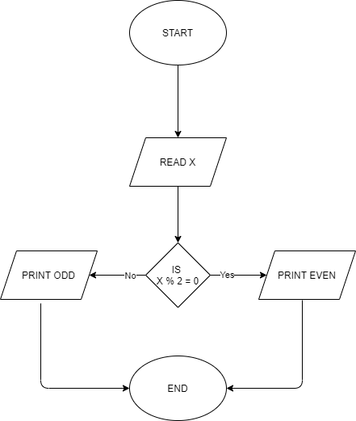

<h1 align="center"><B>ALGORITHM AND FLOWCHART </B></h1>

## <i>Write alogorithm and flowchart to check a number is even or odd.</i>
Step 1: Start

Step 2: Input a number x.

Step 3: if x % 2 = 0 goto step 4 otherwise goto step 5.

Step 4: Print Even.

Step 5: Print Odd.

Step 6: End

   

## <i>Write an algorithm and flowchart for grade distribution.</i>
Step 1: Start

Step 2: Input mark.

Step 3: If mark >= 80 print "distinction" and goto step 7 otherwise goto step 4.

Step 4: If mark >=60 and mark < 80 print "merit" and goto step 7 otherwise goto step 5.

Step 5: If mark >=40 and mark < 60 print "pass"  and goto step 7 otherwise goto step 6.

Step 6: if mark < 40 print "fail" and goto step 7.

Step 7: End.

   

