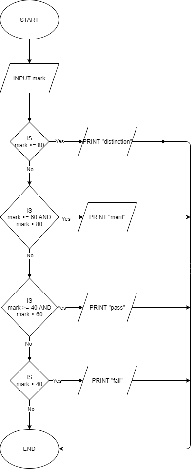

<h1 align="center"><B>ALGORITHM AND FLOWCHART </B></h1>

## <i>Write algorithm and flowchart to check a number is even or odd.</i>
Step 1: Start

Step 2: Input a number x.

Step 3: if x % 2 = 0 goto step 4 otherwise goto step 5.

Step 4: Print Even.

Step 5: Print Odd.

Step 6: End

   

## <i>Write an algorithm and flowchart for grade distribution.</i>
Step 1: Start

Step 2: Input mark.

Step 3: If mark >= 80 print "distinction" and goto step 7 otherwise goto step 4.

Step 4: If mark >=60 and mark < 80 print "merit" and goto step 7 otherwise goto step 5.

Step 5: If mark >=40 and mark < 60 print "pass"  and goto step 7 otherwise goto step 6.

Step 6: if mark < 40 print "fail" and goto step 7.

Step 7: End.

   

   

## <i>Write an algorithm and flowchart for category based insurance available.</i>
Step 1: Start

Step 2: Input category.

Step 3: If category = 'U' then display "insurance is not available" and goto step 8 otherwise goto Step 4.

Step 4: If category = 'A' then display "insurance is double" and goto step 8 otherwise go to step 5.

Step 5: If category = 'B' then display "insurance is normal" and goto step 8 otherwise go to step 6.

Step 6: If category = 'M' then display "insurance is medically dependent" and goto step 8 otherwise go to step 7.

Step 7: Display "entry invalid" and goto step 8.

Step 8: End.

   

   

## Write an algorithm and flowchart to continuously accept a number and display it's square until user enters 0.
Step 1: Start.

Step 2: Accept number.

Step 3: If number = 0 goto Step 6 otherwise goto Step 4.

Step 4: square = number * number.

Step 5: print the square and ask the user to enter new number or 0 to exit and goto Step 2.

Step 6: End.

   

